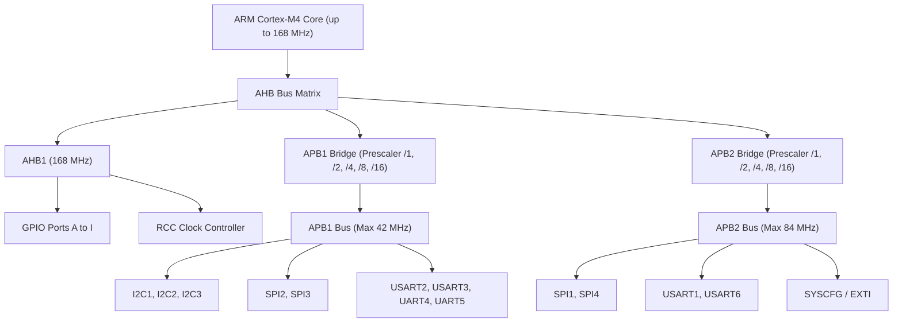
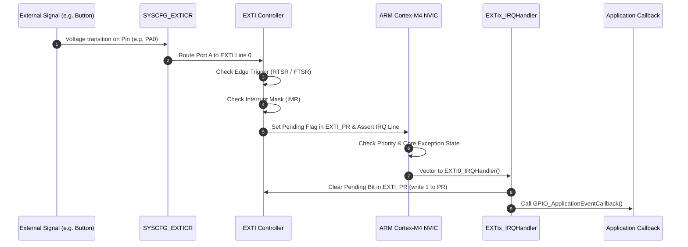
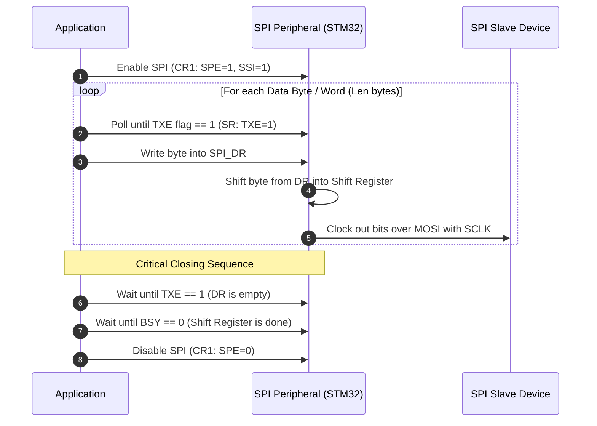
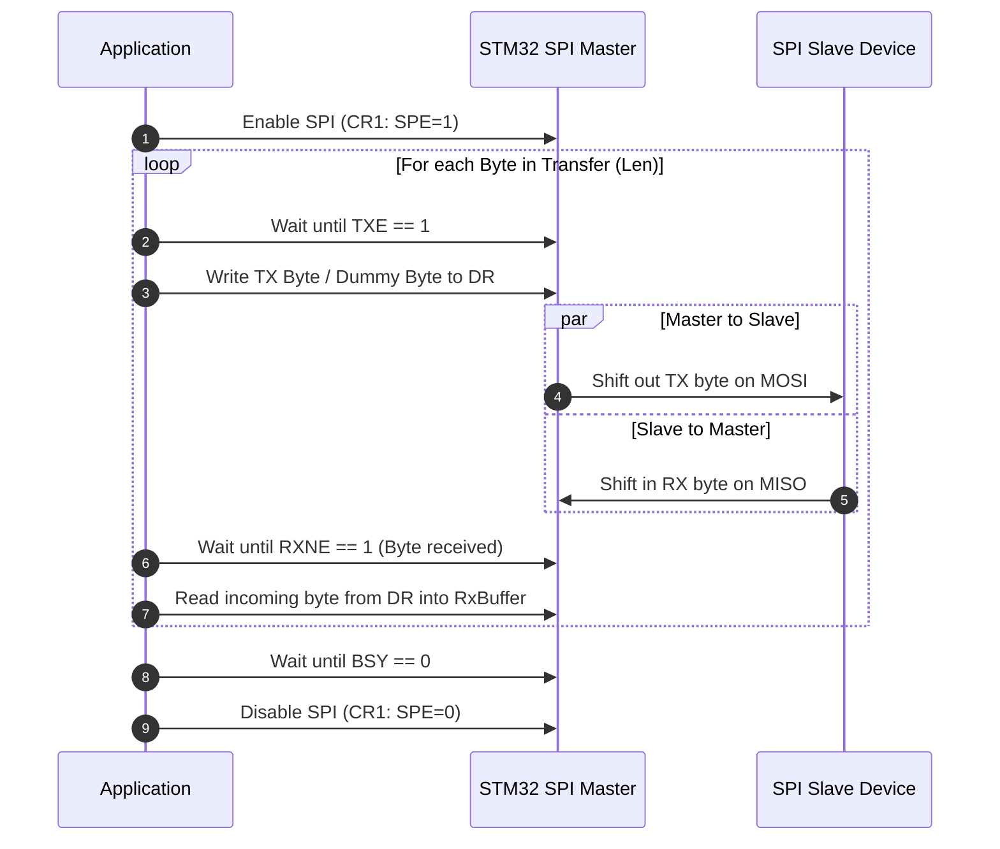
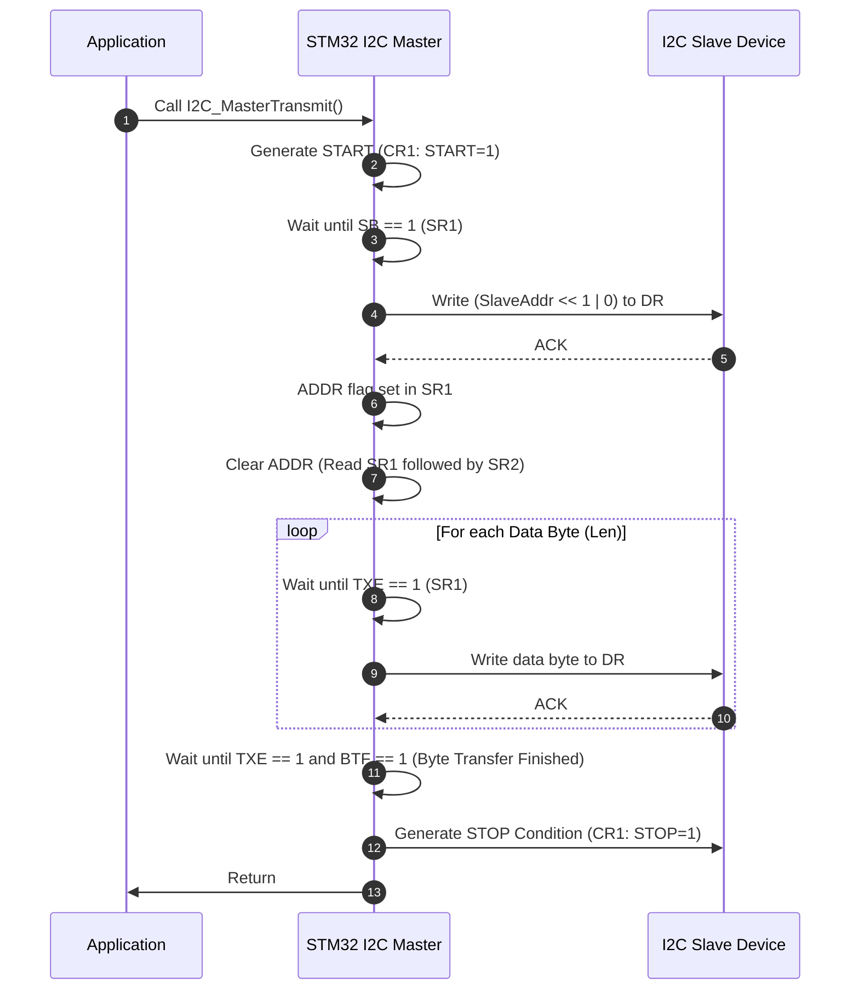
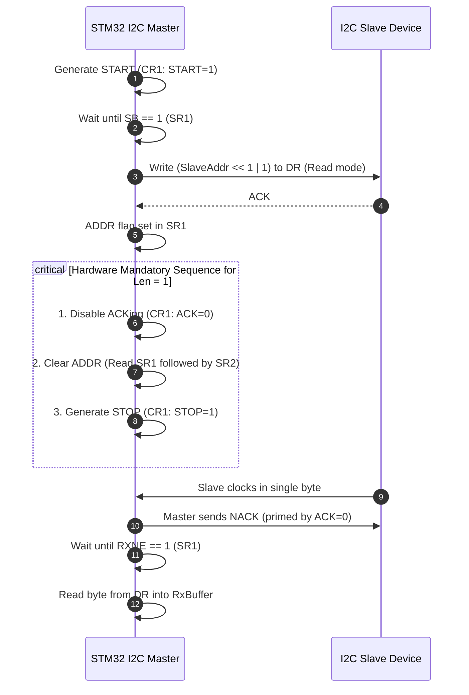
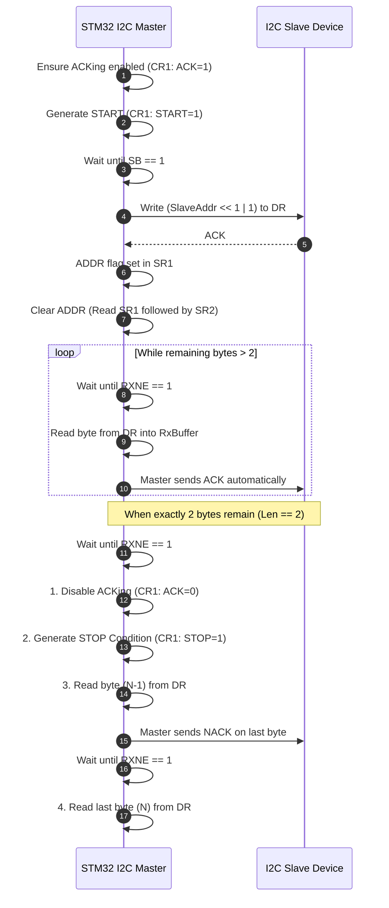
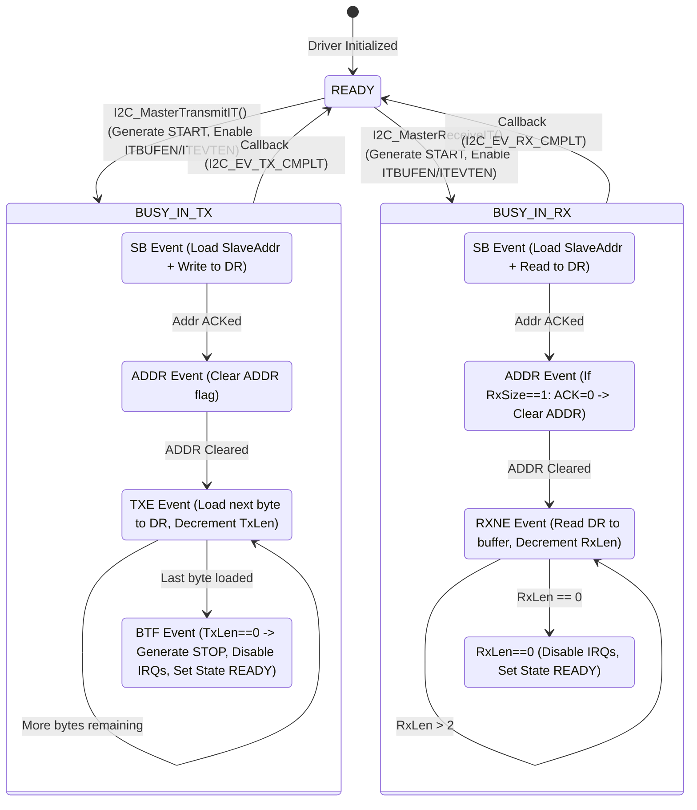
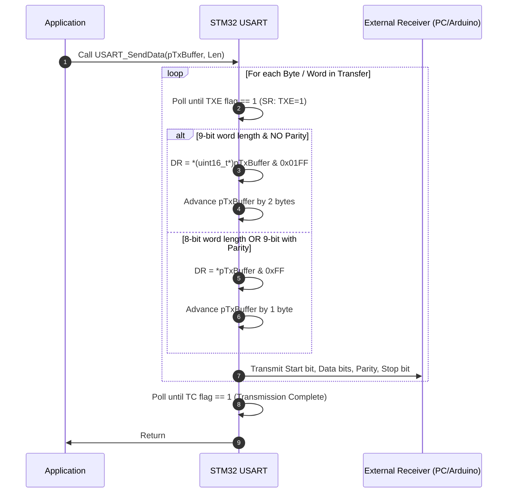
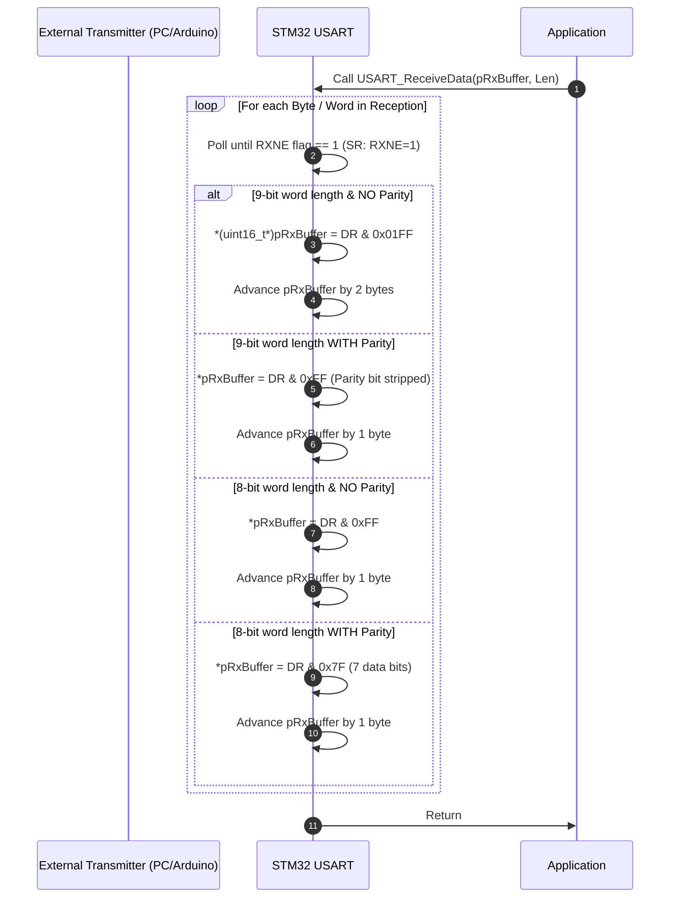

# Bare-Metal STM32F407 Device Driver Development Master Guide
### *Comprehensive Architecture, Implementation Notes, Sequence Flow Diagrams & Embedded Interview Reference*

---

## 📑 Table of Contents
1. [Core MCU & Driver Architecture Overview](#1-core-mcu--driver-architecture-overview)
2. [GPIO Driver (General Purpose Input/Output)](#2-gpio-driver)
   - [2.1 Hardware Registers & Mode Matrix](#21-hardware-registers)
   - [2.2 EXTI Interrupt Flow Diagram](#22-exti--gpio-interrupt-flow-diagram)
3. [SPI Driver (Serial Peripheral Interface)](#3-spi-driver)
   - [3.1 Hardware Architecture & Clock Modes](#31-hardware-architecture--frame-mechanics)
   - [3.2 SPI Master Transmit Sequence Diagram](#32-spi-master-transmit-sequence-diagram)
   - [3.3 SPI Full-Duplex Transmit & Receive Sequence Diagram](#33-spi-full-duplex-transmit--receive-sequence-diagram)
4. [I2C Driver (Inter-Integrated Circuit)](#4-i2c-driver)
   - [4.1 Bus Architecture & Pull-up Math](#41-bus-architecture--signal-dynamics)
   - [4.2 I2C Master Transmit Sequence Diagram](#42-i2c-master-transmit-sequence-diagram)
   - [4.3 I2C Single-Byte Read Sequence Diagram (Len = 1)](#43-i2c-single-byte-read-sequence-diagram-len--1)
   - [4.4 I2C Multi-Byte Read Sequence Diagram (Len > 1)](#44-i2c-multi-byte-read-sequence-diagram-len--1)
   - [4.5 I2C Non-Blocking Interrupt ISR State Machine](#45-i2c-non-blocking-interrupt-isr-state-machine)
5. [USART Driver (Universal Synchronous/Asynchronous Receiver Transmitter)](#5-usart-driver)
   - [5.1 Frame Format & Oversampling](#51-asynchronous-serial-frame-format)
   - [5.2 Fixed-Point Baud Rate Calculation](#52-fixed-point-baud-rate-calculation-brr)
   - [5.3 USART Transmit Sequence Diagram (Blocking & Non-Blocking)](#53-usart-transmit-sequence-diagram)
   - [5.4 USART Receive Sequence Diagram (Blocking & Non-Blocking)](#54-usart-receive-sequence-diagram)
6. [ARM Cortex-M4 NVIC & Interrupt Subsystem](#6-arm-cortex-m4-nvic--interrupt-subsystem)
7. [Comprehensive Embedded Interview Question Bank](#7-comprehensive-embedded-interview-question-bank)

---

## 1. Core MCU & Driver Architecture Overview

### 1.1 Memory Map & Bus Topology (STM32F407VET6)
* **Core**: ARM Cortex-M4 with FPU @ up to 168 MHz.
* **Bus Architecture**:
  * **AHB1 (Advanced High-performance Bus 1)**: GPIOA - GPIOI, RCC, Flash interface, DMA1, DMA2. Max clock: **168 MHz**.
  * **APB1 (Advanced Peripheral Bus 1 / Low Speed)**: TIM2-TIM7, TIM12-TIM14, SPI2, SPI3, USART2, USART3, UART4, UART5, I2C1, I2C2, I2C3, CAN1, CAN2, DAC, PWR. Max clock: **42 MHz**.
  * **APB2 (Advanced Peripheral Bus 2 / High Speed)**: TIM1, TIM8, USART1, USART6, ADC1-ADC3, SDIO, SPI1, SPI4, SYSCFG, EXTI, TIM9-TIM11. Max clock: **84 MHz**.



---

## 2. GPIO Driver

### 2.1 Hardware Registers
Each GPIO port has 10 registers (32-bit each):
* `MODER`: Mode (Input `00`, Output `01`, Alternate Function `10`, Analog `11`).
* `OTYPER`: Output Type (Push-Pull `0`, Open-Drain `1`).
* `OSPEEDR`: Output Speed (Low `00`, Medium `01`, Fast `10`, High `11`).
* `PUPDR`: Pull-up/Pull-down (No PUPD `00`, Pull-up `01`, Pull-down `10`).
* `IDR`: Input Data Register (Read-only, bit $x$ represents Pin $x$).
* `ODR`: Output Data Register (Read/Write output state).
* `BSRR`: Bit Set/Reset Register (Atomic pin set `bits [15:0]` and reset `bits [31:16]`).
* `LCKR`: Port Configuration Lock Register (Freezes pin configuration until next reset).
* `AFR[0] / AFR[1]`: Alternate Function Low (`AFRL` for Pins 0-7) and High (`AFRH` for Pins 8-15) (4 bits per pin).

### 2.2 EXTI & GPIO Interrupt Flow Diagram



---

## 3. SPI Driver

### 3.1 Hardware Architecture & Frame Mechanics
* **Protocol Type**: Synchronous, Full-Duplex or Half-Duplex/Simplex, Master-Slave, 4-Wire (MOSI, MISO, SCK, NSS).
* **Clock Polarity (`CPOL`) & Clock Phase (`CPHA`)**:
  * **Mode 0 (`CPOL=0, CPHA=0`)**: SCLK idles LOW. Data sampled on leading (rising) edge, shifted on falling edge.
  * **Mode 1 (`CPOL=0, CPHA=1`)**: SCLK idles LOW. Data sampled on trailing (falling) edge, shifted on rising edge.
  * **Mode 2 (`CPOL=1, CPHA=0`)**: SCLK idles HIGH. Data sampled on leading (falling) edge, shifted on rising edge.
  * **Mode 3 (`CPOL=1, CPHA=1`)**: SCLK idles HIGH. Data sampled on trailing (rising) edge, shifted on falling edge.

### 3.2 SPI Master Transmit Sequence Diagram



### 3.3 SPI Full-Duplex Transmit & Receive Sequence Diagram



---

## 4. I2C Driver

### 4.1 Bus Architecture & Signal Dynamics
* **Physical Layer**: Open-Drain on both SCL and SDA with external pull-up resistors ($R_P$).
* **Speed Standards**:
  * Standard Mode (Sm): Up to **100 kHz** ($T_{\text{high}} = T_{\text{low}} = 5\mu\text{s}$).
  * Fast Mode (Fm): Up to **400 kHz** (Duty cycle 2:1 or 16:9).

### 4.2 I2C Master Transmit Sequence Diagram



### 4.3 I2C Single-Byte Read Sequence Diagram (Len = 1)



### 4.4 I2C Multi-Byte Read Sequence Diagram (Len > 1)



### 4.5 I2C Non-Blocking Interrupt ISR State Machine



---

## 5. USART Driver

### 5.1 Asynchronous Serial Frame Format
* **Idle Line**: High ($V_{DD}$).
* **Start Bit**: 1 bit LOW ($0$).
* **Data Bits**: 8 or 9 bits (LSB first).
* **Parity Bit (Optional)**: Even or Odd (occupies the MSB bit of the data word).
* **Stop Bits**: 0.5, 1, 1.5, or 2 bits HIGH ($1$).

```
Idle (1) ──┐      ┌───┬───┬───┬───┬───┬───┬───┬───┐     ┌───┐ Idle (1)
           └──────┴───┴───┴───┴───┴───┴───┴───┴───┴─────┘   └───
           START   D0  D1  D2  D3  D4  D5  D6  D7  PARITY STOP
```

### 5.2 Fixed-Point Baud Rate Calculation (`BRR`)
The exact formula:
$$\text{Baud Rate} = \frac{f_{\text{PCLK}}}{8 \times (2 - \text{OVER8}) \times \text{USARTDIV}}$$

```c
// Scaled by 100 to preserve 2 decimal places in integer arithmetic:
if(OVER8 == 1) {
    usartdiv = (25 * PCLK) / (2 * BaudRate);
} else {
    usartdiv = (25 * PCLK) / (4 * BaudRate);
}

M_part = usartdiv / 100;
F_part = usartdiv - (M_part * 100);

if(OVER8 == 1) {
    F_part = (((F_part * 8) + 50) / 100) & 0x07; // +50 performs round-to-nearest
} else {
    F_part = (((F_part * 16) + 50) / 100) & 0x0F;
}

pUSARTx->BRR = (M_part << 4) | F_part;
```

### 5.3 USART Transmit Sequence Diagram



### 5.4 USART Receive Sequence Diagram



---

## 6. ARM Cortex-M4 NVIC & Interrupt Subsystem

### 6.1 NVIC Registers
* **`NVIC_ISER0` - `NVIC_ISER7`**: Interrupt Set-Enable Registers. Writing `1` enables the IRQ. Writing `0` has NO effect.
* **`NVIC_ICER0` - `NVIC_ICER7`**: Interrupt Clear-Enable Registers. Writing `1` disables the IRQ. Writing `0` has NO effect.
* **`NVIC_IPR0` - `NVIC_IPR59`**: Interrupt Priority Registers (8 bits per IRQ).
  * **STM32 Implementation Detail**: Only the top **4 bits** (`[7:4]`) of each 8-bit priority field are implemented (`NO_PR_BITS_IMPLEMENTED = 4`). Priority values range from `0` (highest) to `15` (lowest).
  * Shift formula: `shift_amount = (8 * (IRQNumber % 4)) + (8 - NO_PR_BITS_IMPLEMENTED)`.

---

## 7. Comprehensive Embedded Interview Question Bank

### 🔹 General & Architecture
1. **Q: Why are peripheral registers defined with `volatile` (`__vo`)?**
   * **A**: Hardware registers change asynchronously outside the compiler's control (e.g. status flags set by incoming hardware signals). Without `volatile`, compiler optimization (O2/O3) will cache register reads into CPU general-purpose registers (R0-R12) and generate dead loops (e.g. `while(!FLAG)`), never re-reading the memory-mapped register address.

2. **Q: What is the difference between atomic bit access via `BSRR` versus read-modify-write on `ODR`?**
   * **A**: Read-modify-write (`ODR |= (1 << pin)`) compiles into three assembly instructions (`LDR`, `ORR`, `STR`). If an interrupt fires between `LDR` and `STR` and modifies another pin on the same port, the subsequent `STR` will overwrite and corrupt the interrupt's change. `BSRR` is a single-cycle atomic hardware operation that sets/resets specific pins without affecting other pins on the port.

### 🔹 SPI Peripheral
3. **Q: Why must you wait for `BSY == 0` instead of just `TXE == 1` before disabling SPI?**
   * **A**: `TXE = 1` only means the software data register (`SPI_DR`) is empty because the byte has moved into the internal Shift Register. Shifting the 8/16 bits out onto the wire takes multiple clock cycles. Disabling SPI immediately upon `TXE=1` abruptly cuts off the clock and truncates the transmission mid-byte. `BSY = 0` guarantees the shift register has physically completed transmission.

4. **Q: What is MODF (Master Mode Fault) error in SPI and how do you prevent it?**
   * **A**: In hardware NSS mode, if the MCU is configured as Master and an external signal pulls the `NSS` pin LOW, the SPI hardware detects a bus collision (another master asserting control), clears `SPE` (disables SPI), sets `MODF`, and forces the MCU into Slave mode. To prevent this in single-master systems, enable Software Slave Management (`SSM = 1`) and force internal NSS high by setting `SSI = 1`.

### 🔹 I2C Peripheral
5. **Q: Why does I2C single-byte read require clearing ACK *before* clearing the ADDR flag?**
   * **A**: When `ADDR` is cleared, the I2C shift register immediately begins clocking in data bits from the slave. If `ACK=1` when data reception starts, the hardware will automatically generate an ACK pulse on the 9th SCL clock cycle. By disabling ACK (`ACK=0`) before clearing `ADDR`, hardware is primed to output a NACK on the 9th clock, signaling to the slave that this is the final byte.

6. **Q: What causes I2C bus lockup (SDA held LOW by slave), and how do you recover?**
   * **A**: If the Master resets or encounters an error in the middle of an active byte transfer while the Slave is driving SDA LOW (e.g., transmitting a `0` data bit or ACK), the Slave waits indefinitely for clock pulses to finish its byte. 
   * **Recovery Procedure**: Configure SCL pin as GPIO output, manually toggle SCL for 9 clock cycles to clock out the stuck byte, send a manual STOP condition, and then re-initialize the I2C peripheral.

### 🔹 USART Peripheral
7. **Q: What is the difference between `TXE` and `TC` status flags in USART?**
   * **A**: 
     * `TXE` (Transmit Data Register Empty): Set when data moves from `DR` into the Transmit Shift Register. Signals that software can safely write the next byte into `DR`.
     * `TC` (Transmission Complete): Set only when the entire frame (including the last stop bit) has physically left the Transmit Shift Register and the transmitter is completely idle. Used before putting the MCU to sleep, turning off the transceiver, or switching RS-485 direction lines.

8. **Q: Why does 9-bit word length require 2 bytes of buffer advance only when Parity is disabled?**
   * **A**: In STM32 USART, the `M` bit sets the total frame size. If 9-bit is selected and parity is enabled, the 9th bit is generated automatically by the hardware parity engine from the 8 data bits provided in a 1-byte user buffer. If parity is disabled, all 9 bits are data provided by the user, which cannot fit in an 8-bit `uint8_t` and must be stored as a 16-bit (`uint16_t`) integer (advancing 2 bytes per transfer).
